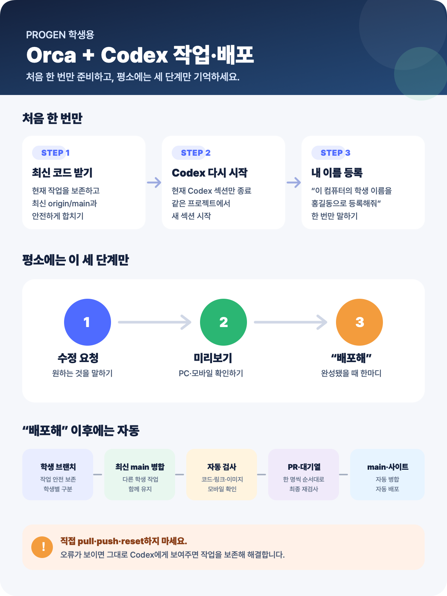

# 학생용 Orca + Codex 작업·배포 가이드

이 가이드는 **이미 Orca에서 팀 저장소를 clone한 학생**을 위한 안내입니다.
재클론하거나 학생별 MD 파일을 만들 필요가 없습니다.



## 가장 중요한 한 줄

평소에는 **수정 요청 → 미리보기 확인 → “배포해”**만 하면 됩니다.

---

## 수업 시작 전에 최초 1회만

### STEP 1. 현재 작업을 보존하면서 최신 코드 받기

현재 열려 있는 Codex 대화창에 아래 문장을 그대로 보내세요.

```text
현재 작업을 절대 지우지 말고 안전하게 보존한 다음,
최신 origin/main을 받아서 내 작업과 합쳐줘.
```

Codex가 완료했다고 말할 때까지 기다립니다.

- 작업 중인 파일이 있어도 삭제하거나 초기화하지 않습니다.
- 충돌 때문에 Codex가 질문하면 어느 문구나 디자인을 남길지 답합니다.
- 터미널에서 `pull`, `reset`, `checkout` 명령을 직접 실행하지 않습니다.

### STEP 2. Codex 섹션 다시 시작하기

최신 코드 반영이 끝났다면 Orca에서 **현재 Codex 섹션만 종료**하고, 같은 프로젝트에서 새 Codex 섹션을 시작하세요.

- 프로젝트 폴더를 삭제하지 않습니다.
- clone을 다시 받지 않습니다.
- Orca 작업트리를 삭제하지 않습니다.

새 섹션을 시작해야 저장소의 새로운 안전 배포 규칙이 적용됩니다.

### STEP 3. 내 이름 등록하기

새 Codex 대화창에 아래처럼 본인 이름이나 번호를 넣어 말하세요.

```text
이 컴퓨터의 학생 이름을 홍길동으로 등록해줘.
```

이름은 이 컴퓨터에만 한 번 저장됩니다. GitHub 로그인 계정이나 비밀번호는 바뀌지 않습니다.

> 같은 팀이 하나의 GitHub 계정을 사용해도 학생 이름·고유 작업 브랜치·PR 제목으로 누가 작업했는지 구분됩니다.

---

## 평소 작업할 때

### STEP 4. 담당 페이지 확인하기

팀원끼리 가능하면 서로 다른 페이지를 맡으세요.

| 담당 | 주로 수정할 파일 |
|---|---|
| 홈 | `index.html` |
| 브랜드 소개 | `about.html` |
| 제품 | `products.html`, `product.html` |
| 포트폴리오·문의 | `portfolio.html`, `contact.html` |
| 공통 디자인 | `style.css`, 헤더, 푸터 |

`style.css`, 헤더, 푸터는 모든 페이지에 영향을 주므로 같은 시간에는 한 명이 맡는 것이 안전합니다.

### STEP 5. Codex에게 수정 요청하기

어디를 어떻게 바꿀지 평소 말로 요청하면 됩니다.

```text
홈 화면 히어로 제목을 “새로운 일상”으로 바꿔줘.
```

```text
제품 카드 간격을 넓히고 모바일 화면도 확인해줘.
```

```text
문의 페이지에 인스타그램 버튼을 추가해줘.
```

Codex는 작업을 시작하기 전에 원격의 최신 코드를 자동으로 확인합니다.

### STEP 6. 미리보기 확인하기

수정이 끝나면 아래처럼 말하세요.

```text
로컬 미리보기 보여줘.
데스크톱과 모바일 화면도 확인해줘.
```

확인할 항목:

- 글자와 이미지가 맞는지
- 버튼과 메뉴가 정상적으로 눌리는지
- 모바일에서 가로 스크롤이나 겹침이 없는지
- 다른 페이지의 헤더와 푸터가 깨지지 않았는지

수정할 것이 남았다면 계속 요청합니다. 작은 수정마다 배포하지 않습니다.

### STEP 7. 완성되면 배포하기

완성되었을 때 아래 한마디만 보내세요.

```text
배포해
```

그러면 Codex가 자동으로 다음 작업을 처리합니다.

1. 현재 작업을 학생 전용 브랜치에 안전하게 보존
2. 최신 `main`과 학생의 전체 변경분 비교
3. 다른 학생 작업과 운영 데이터가 유지되도록 병합
4. HTML·CSS·JavaScript·JSON·링크·이미지 검사
5. GitHub PR 생성
6. 최신 `main`과 합친 결과를 한 번 더 검사
7. 병합 대기열에서 순서대로 `main`에 병합
8. 웹사이트 자동 배포

### STEP 8. 배포 완료 확인하기

Codex의 마지막 안내에서 아래 내용을 확인하세요.

- 내 학생 이름
- PR 주소
- 검사 통과
- 병합 완료

**“검사 통과·병합 완료”**가 확인되면 잠시 뒤 팀 웹사이트를 새로고침합니다.

---

## 문제가 생겼을 때

### GitHub 로그인을 요청할 때

GitHub CLI가 연결되지 않은 컴퓨터만 최초 한 번 팀 GitHub 계정으로 로그인합니다. 로그인 후 Codex에게 아래처럼 말하세요.

```text
로그인 끝났어. 중단한 배포를 계속해줘.
```

### 충돌이 났을 때

```text
현재 작업과 다른 학생 작업을 모두 보존하면서 충돌을 해결해줘.
판단이 필요한 부분만 나에게 물어봐.
```

### 검사에 실패했을 때

```text
실패 원인을 고치고 같은 PR로 다시 검사해서 배포해줘.
```

### main push가 거부됐을 때

정상적인 보호 동작입니다. 직접 우회하지 말고 아래처럼 말하세요.

```text
main에 직접 push하지 말고 학생 브랜치와 PR 방식으로 배포해줘.
```

---

## 직접 하지 않을 것

- `main`에 직접 push
- force push
- `reset --hard`
- 다른 학생 브랜치나 작업트리 삭제
- `.github`, `AGENTS.md`, `wrangler*.jsonc`, `worker.js` 수정
- 관리자 파일이나 `products.json`, `portfolio.json` 직접 수정

Git 오류가 보이면 임의로 명령을 실행하지 말고 오류 내용을 Codex에게 그대로 보여주세요.

---

## 정말 이것만 기억하세요

1. **원하는 수정을 말한다.**
2. **미리보기를 확인한다.**
3. **완성되면 “배포해”라고 말한다.**

나머지는 Codex와 GitHub가 처리합니다.
